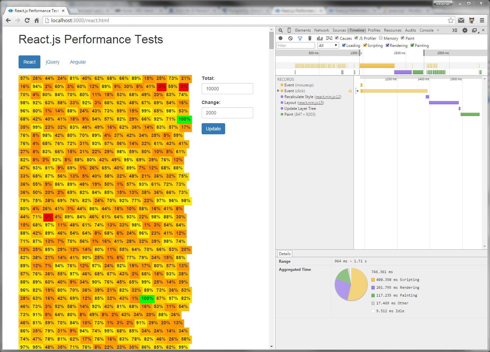
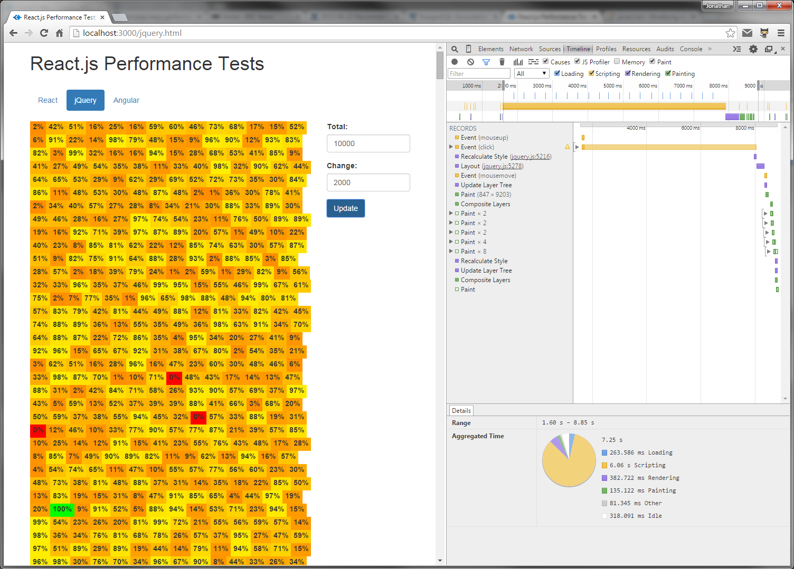

# React.js Performance Tests

The main objective was to test React.js’ relative performance of rendering browser updates against comparable frameworks, or approaches.  

A secondary objective was whether I should replace jQuery plugin’s as my chosen method of implementing modular, reusable web UI components.

## Framework Selection

**React.js** was a given, the whole point of exercise was to test whether React.js would live up to the hype the Facebook team presented.

**jQuery** was the next obvious choice, as I have a lot of experience developing web components using jQuery and direct DOM manipulation.

Finally, I wanted to ensure I compared React against another modern framework.  My decision to choose **Angular.js** was straight forward, from my experience it’s one of the most populate frameworks around; quickly confirmed by its popularity on [GitHub](https://github.com/showcases/front-end-javascript-frameworks).

## Considerations

### Fairness

The test scenario was purposely kept as simple as possible, in order that the implementation would translate as cleanly as possible between test frameworks.  I wanted to try and avoid introducing any unfair scenarios where one approach had a particular niche, or needed any complex implementation strategy.

### Real World Scenario

I wanted to make the test scenario as real world as possible, the test’s had to be a practical application.  

Over the past 10+ years I’ve been involved in varying degrees in the development of real-time service dashboards, which typically involves a lot of high frequency DOM manipulation.  Based on this experience, I decided the test scenario would be a dashboard which displayed a value and associated colour.  The implementation would be simply but would be designed to stress test the respective frameworks.

## Implementation

A grid of elements, each responsible for displaying two things 1. a percent value between 0 and 100%, 2. a colour associated with this value.   The colour would be calculated at the same time as the data is populated, with 100 being green, 1-99 as a gradual shade of amber (actually, yellow through to dark orange) and 0 would be red.

The data would be generated independantly of the dashboard implementation and each implementation would make the same data request.  There should be no advantage gained by either implementation.  In order to test different scenarios, I made the size of the grid and the number of changes configurable via the test interface.

You can view the code implementation in this project, and a live demo is available to view [here](http://jonmiles.github.io/react-performance-tests).

## Results

The below sample test results where generated based on a total of 10,000 dashboard elements, with a random 20% of those elements being updated on each update request.

**React.js**  

Rendering: 202ms

**jQuery**  

Rendering: 383ms

**Angular.js** 

Rendering: 197ms

Again this is only a sample, please feel free to test it yourself using the [live demo](http://jonmiles.github.io/react-performance-tests).

## Conclusion

React.js certainy faster the jQuery and direct DOM manipulation approach, in fact nearly twice as fast.  In a way that was to be expected, as jQuery has no fancy update implementation (e.g. Shadow DOM +diff) and literally rebuilds the entire grid on each render.

What I wasn't necessarily expecting was that Angular.js would be at least as fast, or faster (in the sample results above).  Yet over many test, over many days, the results were always the same with no noticable difference between React and Angular in terms of time taken to render updates.